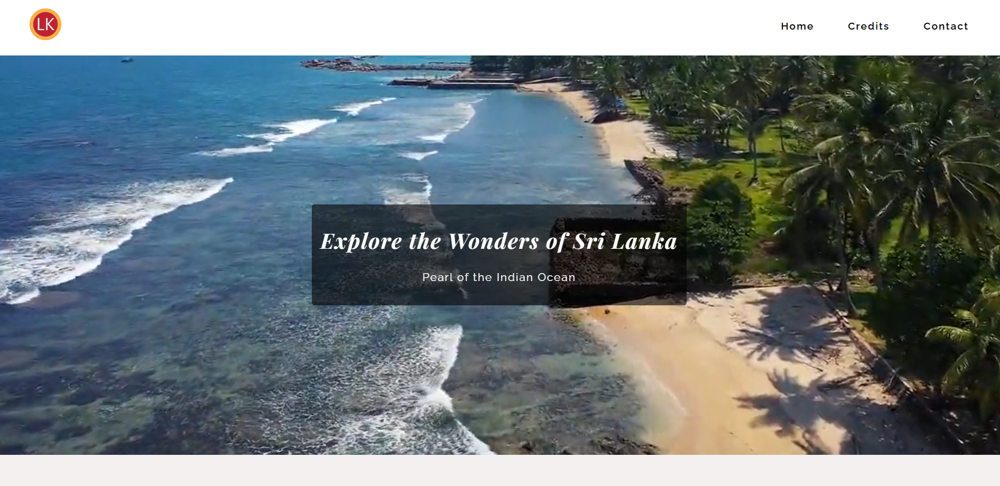

🌍 Country Website
A responsive country (Sri lanka )information website built using HTML, CSS, and JavaScript. 

🚀 Live Demo
🔗 [View Site on github page](https://shanikauwu1.github.io/country-website)

🛠️ Technologies Used
<li>
HTML5  
</li>
<li>CSS3</li>
<li>JavaScript (ES6)</li>
<li>Git</li>

📸 Screenshot

📜 License
This project is licensed under the MIT License.
